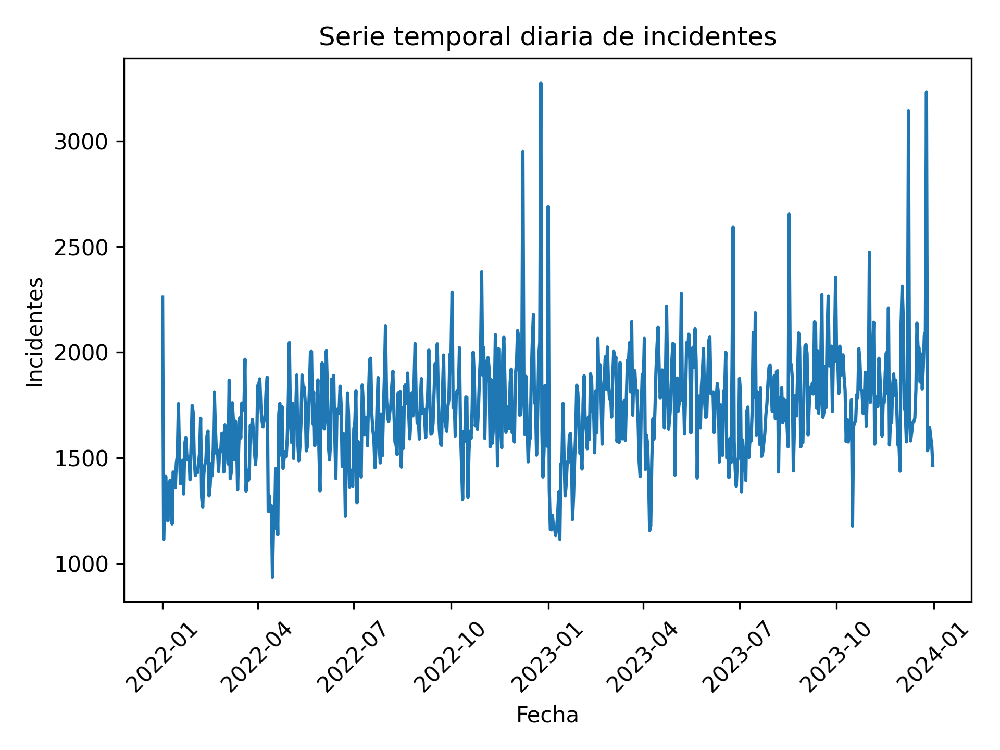

# Quiz_crue

## 📊 Análisis de Incidentes del CRUE

Este proyecto examina datos diarios del Centro Regulador de Urgencias y Emergencias, registrando tendencias en incidentes de salud críticos durante 2022-2023.

## 📌 Descripción de los datos

Este proyecto analiza registros diarios del Centro Regulador de Urgencias y Emergencias (CRUE).  
El CRUE gestiona incidentes de salud críticos, incluyendo:

- Accidentes caseros (traumas, quemaduras)
- Violencia de género (tentativa de feminicidio, violencia sexual)
- Emergencias médicas (problemas respiratorios, dolores torácicos)

La entidad atiende miles de llamadas diarias y coordina ambulancias 24/7 a través de la línea 123.

- 📊 Total de registros: 730
- 📅 Periodo: 2022 - 2023
- 📌 Frecuencia: diaria

---

## 👥 Colaboradores

| Nombre              | GitHub              |
|---------------------|---------------------|
| Camilo Velandia     | camilousta02        |
| Michael Morantes    | michaelmorantesp    |

---

## 📈 Hallazgos principales

| Estadística | Valor |
|-------------|--------|
| Promedio general de incidentes | 1717.47 |
| Mediana | 1711.00 |
| Desviación estándar | 256.31 |
| Coeficiente de variación | 14.92% |
| Rango (máx - mín) | 2340 |
| Día con más incidentes | 25-12-2022 (3275) |
| Día con menos incidentes | 15-04-2022 (935) |
| Año con mayor promedio | 2023 (1767.85) |
| Día de la semana con más incidentes | Domingo (1880.04) |
| Mes con mayor promedio | Diciembre (1881.02) |
| Mes con menor promedio | Enero (1460.61) |

---

## 🔎 ¿Se puede predecir?

Sí, es posible realizar predicciones debido a que los datos presentan patrones temporales claros, especialmente efectos estacionales por mes y por día de la semana. El aumento en fines de semana y en diciembre sugiere comportamiento sistemático. Modelos de series de tiempo como Holt-Winters o ARIMA podrían capturar tendencia y estacionalidad para generar pronósticos confiables.

## 📊 Serie Temporal Diaria

## 📆 Promedio Mensual de Incidentes

